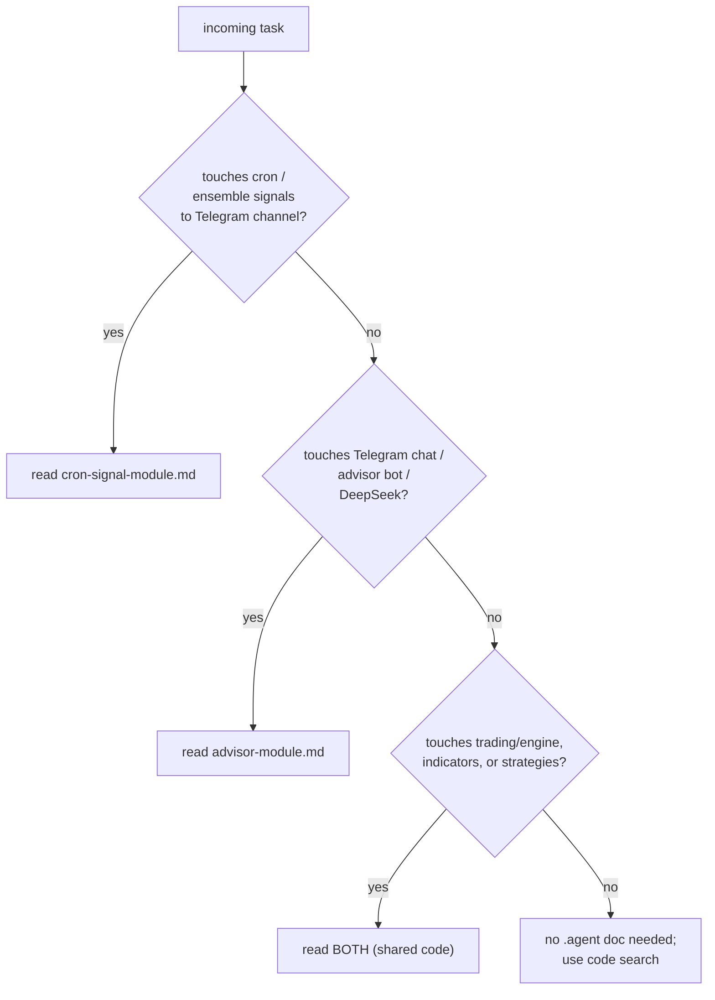

# .agent — Engineering Context Docs

Short, self-contained context files for priming future prompts. Each file
is meant to be dropped into a chat as-is so the agent has enough context
to modify the module without re-reading the whole codebase.

## Index

| File                                         | Scope                                                                                                | When to include                                                                                                                                                 |
| -------------------------------------------- | ---------------------------------------------------------------------------------------------------- | --------------------------------------------------------------------------------------------------------------------------------------------------------------- |
| [cron-signal-module.md](cron-signal-module.md) | The existing cron-based signal broadcaster (H1/H4/D1 ensemble → Telegram channel + DB).              | Any task touching `cron_jobs/`, `trading/engine`, `trading/strategies`, `trading/indicators`, `notifier/`, `modules/strategy_version`, or `modules/order` fire-signal persistence. |
| [advisor-module.md](advisor-module.md)       | The conversational Telegram chat bot (Phase 1: chat-only; Phase 2 adds market data). Backend long-polls Telegram, streams DeepSeek, edits bubbles progressively. | Any task touching `modules/advisor/`, `telegram/advisor_*`, DeepSeek client, or Redis session keys `advisor:*`.                                                    |

## Global conventions (apply to every doc here)

- **Codebase**: single Go binary (`j_ai_trade`), Gin + GORM + cron, deployed
  locally. No microservices. Clean-arch per module (`biz/`, `storage/`,
  `transport/gin/`, `model/dto/`).
- **Shared packages**: `trading/engine`, `trading/strategies`,
  `trading/indicators`, `brokers/binance`, `common`, `notifier`,
  `telegram`. Prefer reusing these over duplicating.
- **Docs language**: English. Diagrams via Mermaid (no inline styling — it
  breaks the dark theme).
- **When a doc becomes stale**: update it in the same PR that changes the
  code. The doc IS the prompt — drift here costs LLM accuracy in every
  future session.

## Which doc to read for a request

