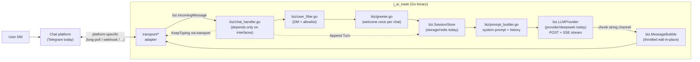

# Advisor Module — Engineering Context

> Drop this file into any prompt to give the agent full context on the advisor
> module. Keep it short, concrete, and up to date.

## 1. Purpose (one paragraph)

The **advisor** module is a conversational Telegram bot — a trader-buddy
chat companion — that lives inside the existing `j_ai_trade` Go binary.
Phase 1 scope is deliberately narrow: users DM a separate bot, the backend
long-polls Telegram, streams replies from **DeepSeek**, and edits the
Telegram bubble progressively so the UX feels like texting a person.
Phase 1 has **no market-data pipe yet** — when a user asks for a concrete
signal ("XAU buy hay sell?") the bot honestly says the feature is coming
and keeps the conversation going. Phases 2/3 (listed in §12) add candle
digests, ensemble-on-demand, proactive alerts, etc. The existing cron-based
signal broadcaster is completely untouched and runs in parallel under a
different bot token.

## 2. Who orchestrates what (IMPORTANT)

- **Backend (this repo) = the brain.** It holds the DeepSeek API key and
  the Telegram bot token, long-polls Telegram, calls DeepSeek, and edits
  Telegram messages to stream tokens. No external relay, no OpenClaw.
- **DeepSeek = stateless reasoning engine.** It streams tokens back over
  SSE; it does NOT call back into our backend.
- **Telegram Bot API = transport only.** Long-polling (`getUpdates`) for
  ingress, `sendMessage` / `editMessageText` / `sendChatAction` for egress.

If a future decision is to flip any of this (function-calling DeepSeek,
webhook mode instead of polling, a relay in front), update this doc first.

## 3. End-to-end data flow



Key invariants:

- One Telegram update -> one goroutine in `ChatHandler.handleMessage`. Slow
  DeepSeek replies for user A never block user B.
- `editMessageText` is throttled to one call per ~500ms per chat. The
  first `sendMessage` call is subject to the same window so the opening
  paint carries substantive text instead of a 1–2 character flash; the
  typing indicator covers the pre-paint gap.
- Session history is rolling — oldest turns are trimmed, TTL slides on
  every append. Restart-safe because state lives in Redis, not RAM.
- Non-fatal everywhere: missing `DEEP_SEEK_API_KEY`, missing bot token, or
  a Redis outage only disables the bot; cron + HTTP API keep running.

## 4. Module layout — hexagonal, three isolated seams

The advisor is structured as a pure domain core (`biz/`) surrounded by
three interchangeable adapters. **Adding a new LLM vendor, chat platform,
or session backend never touches `biz/`** — you drop a sibling package
into `provider/`, `transport/`, or `storage/` that satisfies the matching
interface, then change one line in `advisor_init.go`.

```
modules/advisor/
  advisor_init.go                 wires the three adapters into ChatHandler

  biz/                            DOMAIN CORE — interfaces + pure logic only
    llm_provider.go               interface LLMProvider (Stream, Name)
    chat_transport.go             interface ChatTransport + MessageBubble +
                                      IncomingMessage DTO
    session_store.go              interface SessionStore
    chat_handler.go               orchestrator: depends ONLY on the 3 above
    user_filter.go                platform-neutral DM/allowlist rule
    prompt_builder.go             SystemPrompt constant + BuildMessages()
    greeter.go                    WelcomeMessage constant

  model/
    turn.go                       Turn{Role,Content,Time} — OpenAI-shape DTO

  provider/                       LLM VENDOR ADAPTERS
    deepseek/
      client.go                   biz.LLMProvider impl (SSE streaming)
    (openai/, anthropic/, ...)    future siblings; no changes elsewhere

  storage/                        SESSION BACKEND ADAPTERS
    redis/
      session_store.go            biz.SessionStore impl (LIST + TTL)
    (postgres/, memory/, ...)     future siblings

  transport/                      CHAT PLATFORM ADAPTERS
    telegram/
      transport.go                biz.ChatTransport impl (wraps telegram/)
    (zalo/, discord/, slack/, ...)  future siblings

telegram/                         LOW-LEVEL TELEGRAM PRIMITIVES
  telegram_service.go             EXISTING — cron broadcaster (untouched)
  advisor_bot.go                  AdvisorBot: raw getUpdates / sendMessage /
                                      editMessageText / sendChatAction
  advisor_types.go                Update/Message/Chat/User DTOs
  listener.go                     long-poll loop -> chan Update
  typing.go                       KeepTyping helper (tick 4s)
  stream_editor.go                ProgressiveMessage (throttled edit)
```

Key dependency rules enforced by the layout:

- `biz/` imports only `model/` and stdlib/log. Grep proof:
  `grep -r "j_ai_trade/" modules/advisor/biz` returns only `.../model`.
- `telegram/` imports nothing from `modules/advisor/*`. It's a reusable
  low-level package; the adapter in `transport/telegram/` is the only
  bridge.
- Adapter packages never import each other — they all depend inward on
  `biz/` and `model/`.

No `transport/gin/` yet — Phase 1 has zero HTTP surface. The advisor is
100% push-driven by the chat transport's Updates channel.

## 5. Runtime control flow (per user message)

Every step below references ONLY interface types — concrete vendor/
platform names are resolved at construction time in `advisor_init.go`.

```
1. ChatTransport.Updates()  normalized biz.IncomingMessage on channel
2. ChatHandler.Run          receives msg, fans out to handleMessage goroutine
3. UserFilter.ShouldHandle  msg.IsDM && (allowlist empty || userID allowed)
4. handleCommand            /start /reset /help short-circuit the LLM
5. maybeGreet               TryGreet (atomic SETNX) -> SendMessage(WelcomeMessage)
6. ChatTransport.KeepTyping spawn ticker sending "typing" every 4s
7. SessionStore.Load        LRANGE advisor:session:<chat_id>
8. BuildMessages            [system, ...history, {user, text}]
9. LLMProvider.Stream       returns <-chan string, <-chan error
10. ChatTransport.NewBubble  biz.MessageBubble backed by the platform
11. bubble.Start("") -> bubble sends lazily on first Append -> Finish flushes last edit (typing indicator stays visible until first token)
12. SessionStore.Append     RPUSH user turn, RPUSH assistant turn, LTRIM, EXPIRE
```

Per-message budget: 90s (context.WithTimeout). Even if the LLM hangs the
bubble won't stay stuck forever.

## 6. Prompt contract

The system prompt is in `biz/prompt_builder.go` as `SystemPrompt`. Key
rules pinned there (edit ONLY via that constant — single source of truth):

- Respond in user's language (VI or EN auto-detected by DeepSeek itself).
- Short replies (2–5 sentences) for chat vibe; no heavy markdown.
- **Never fabricate market data.** When asked for a concrete signal the
  bot must acknowledge Phase 1 has no data feed and ask for context.
- Friendly trader-buddy tone; ≤1 emoji per reply.

Each DeepSeek call receives: `[system, ...history_from_redis, user_message]`.
No other metadata is injected in Phase 1 (no market blob, no news digest).

## 7. Reuse of existing code

- **`telegram/telegram_service.go`** — NOT used by advisor. That's the cron
  bot (`J_AI_TRADE_BOT_V1`) pushing signals to a fixed channel.
- **`telegram/advisor_*.go` + `telegram/stream_editor.go` + `telegram/typing.go`** —
  low-level Telegram Bot API primitives. Re-usable outside the advisor if
  any other module ever needs conversational Telegram I/O. The
  advisor-specific wiring lives in `modules/advisor/transport/telegram/`.
- **`config/redis/redis.go`** — reused. `RedisClient.GetClient()` is passed
  into `advisor.Init`.
- **`logger`** (zerolog) — standard `log.Info()/Warn()/Error()` used
  throughout the module.

Advisor does NOT (yet) touch: `trading/engine`, `brokers/binance`,
`notifier`, `modules/order`. Phase 2 wires those in.

## 7a. How to add a new adapter

### New LLM vendor (e.g. OpenAI)

1. `modules/advisor/provider/openai/client.go` — struct implementing
   `biz.LLMProvider` (methods: `Stream(ctx, []model.Turn) (<-chan string, <-chan error)`
   and `Name() string`).
2. Add env vars (`OPENAI_API_KEY`, `OPENAI_MODEL`, ...).
3. In `advisor_init.go` swap the one line:
   `llm, err := openaiProvider.New()` (or gate on an env var to choose).
4. No change in `biz/`, `transport/`, `storage/`.

### New chat platform (e.g. Zalo, Discord)

1. `modules/advisor/transport/zalo/transport.go` — struct implementing
   `biz.ChatTransport` (methods: `Updates`, `SendMessage`, `NewBubble`,
   `KeepTyping`, `Name`). Whatever streaming-edit primitives the platform
   exposes (Discord allows message edits too; Zalo may need
   "delete + resend" semantics) are hidden inside a private
   `biz.MessageBubble` impl in the adapter package.
2. Add the bot-token / credentials env var.
3. In `advisor_init.go`:
   `transport, err := zaloTransport.NewTransport(ctx)`.
4. No change in `biz/`, `provider/`, `storage/`.

### New session backend (e.g. Postgres for durable audit)

1. `modules/advisor/storage/postgres/session_store.go` — implements
   `biz.SessionStore` (5 methods).
2. Migration: add `advisor_sessions` table via
   `config/postgres/AutoMigrate`.
3. In `advisor_init.go`:
   `store := postgresStorage.NewSessionStore(db)`.

The compile-time `var _ biz.LLMProvider = (*Client)(nil)` guard in every
adapter file ensures mismatches surface at build time, not at runtime.

## 8. Environment variables

| Env var                       | Required | Purpose                                                      |
| ----------------------------- | -------- | ------------------------------------------------------------ |
| `J_AI_TRADE_ADVISOR`          | yes      | Telegram bot token for the advisor bot (separate from cron). |
| `DEEP_SEEK_API_KEY`           | yes      | DeepSeek API key. Held ONLY by backend. Never logged.        |
| `DEEP_SEEK_BASE_URL`          | no       | Default `https://api.deepseek.com`.                          |
| `DEEP_SEEK_MODEL`             | no       | Default `deepseek-chat`. `deepseek-reasoner` also supported. |
| `ADVISOR_ALLOWED_USER_IDS`    | no       | Comma-separated Telegram user IDs. Unset = public.           |
| `REDIS_HOST`, `REDIS_PORT`    | yes      | Already used by the rest of the app.                         |

JWT `AuthMiddleware` is not involved — advisor has no HTTP routes.

## 9. Session persistence (Redis layout)

```
advisor:session:<chat_id>    LIST<json(Turn)>   trimmed to last 12, TTL 30m slide
advisor:greeted:<chat_id>    STRING "1"         TTL 30 days
```

Why Redis over Postgres for Phase 1:

- Built-in TTL keeps state bounded without a cron job.
- Atomic RPUSH+LTRIM+EXPIRE via pipeline.
- Sub-ms latency on every message.
- Already configured in the repo.

Phase 2 can add a durable `advisor_sessions` table in Postgres for audit
logs without changing the `SessionStore` interface.

## 10. Failure modes & fallbacks

| Failure                              | Behavior                                                        |
| ------------------------------------ | --------------------------------------------------------------- |
| `J_AI_TRADE_ADVISOR` missing         | Log warn, `advisor.Init` returns early. Cron + HTTP keep going. |
| `DEEP_SEEK_API_KEY` missing          | Same — advisor disabled, rest of app fine.                      |
| Redis unreachable at startup         | `advisor.Init` is skipped in `main.go`.                         |
| Redis hiccup mid-session             | Load returns empty -> bot answers without history. Append logged. |
| DeepSeek non-2xx / timeout           | Stream error drained; if no tokens arrived user sees a polite apology message; existing bubble stays if partial. |
| Telegram 429 / edit-rate-limit       | `editMessageText` error is logged at debug; next flush retries. |
| `getUpdates` transient error         | Linear backoff 1s -> 2s -> ... 30s, retries forever.            |
| Handler panic                        | `defer recover()` in `handleMessage`; logs + returns.           |

## 11. Testing plan (not yet implemented)

Hexagonal layout makes test writing easy — `biz/` is tested with **fakes
of the three interfaces**, no real vendor calls:

- `storage/redis/session_store_test.go` — miniredis; assert trim + TTL.
- `provider/deepseek/client_test.go` — `httptest.Server` returning canned
  SSE events; verify chunk channel, graceful `[DONE]`, error path.
- `transport/telegram/transport_test.go` — intercept HTTP with
  `httptest.Server`; verify `IncomingMessage` normalization + bubble edits.
- `biz/prompt_builder_test.go` — system prompt is first message + history
  order preserved.
- `biz/user_filter_test.go` — table-driven: DM/group, allowlist on/off.
- `biz/chat_handler_test.go` — fake `ChatTransport` + fake `LLMProvider`
  (in-memory channel) + miniredis-backed store. End-to-end: greeting
  only once, reset clears, bubble sees >=1 append.

## 12. Phase 2/3 roadmap (tracked here so we don't forget)

### Phase 2 — market data + structured signals

- Extract `buildEnsemble` from `cron_jobs/` to `trading/engine.DefaultEnsembleFor(tf)`
  so cron + advisor share one strategy set.
- `biz/symbol_normalizer.go` — "XAU USD" / "GOLD" / "BTC" -> Binance symbol.
- `biz/digest_candles.go` — EMA/RSI/ATR/S-R digest per TF.
- `biz/market_clock.go` — next H1/H4/D1 close + recommended recheck minutes.
- `biz/pair_snapshot.go` — fetch -> digest -> ensemble -> compact JSON blob
  injected as an extra user message before the actual question.
- Strict JSON output schema (BUY/SELL/WAIT + TP/SL/confidence/rationale).
- Audit table `advisor_sessions` in Postgres.

### Phase 3 — proactive + multi-modal

- Bot DMs the user when the cron's ensemble fires a high-confidence signal
  matching their watchlist ("Hey, XAU just printed a bullish BOS on H1...").
- Switch DeepSeek model to `deepseek-reasoner` for signal-generation
  requests (keep `deepseek-chat` for small talk to save tokens).
- Per-user rate limiting / cost tracking.
- Optional webhook mode (`setWebhook`) for lower first-token latency in
  prod (polling is fine for local dev).
