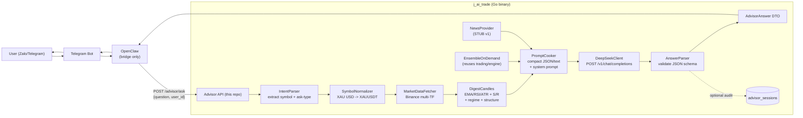

# Advisor Module — Engineering Context

> Drop this file into any prompt to give the agent full context on the advisor
> module. Keep it short, concrete, and up to date.

## 1. Purpose (one paragraph)

The **advisor** module is a new HTTP service (mounted inside the existing
`j_ai_trade` Go binary) that answers ad-hoc trading questions from end users
such as *"Should I buy or sell XAU/USD right now? What TP/SL?"*. Users chat
with a Telegram/Zalo bot; OpenClaw relays the message to our backend; the
backend fetches market data (candles, indicators, optional news), **cooks it
into a compact prompt**, sends it to **DeepSeek**, parses DeepSeek's
reasoning into a structured decision (direction, entry, SL, TP, confidence,
recheck-after-minutes, retest plan), and returns it upstream. The existing
cron-based signal broadcaster is untouched and keeps running in parallel.

## 2. Who orchestrates what (IMPORTANT)

- **Backend (this repo) = the brain orchestrator.** It holds the DeepSeek API
  key, calls DeepSeek, cooks data, parses the LLM answer. DeepSeek receives
  input **only after** data has been cooked at the backend.
- **OpenClaw = dumb transport bridge** between Telegram and our backend.
  It holds no secrets, does no reasoning. Think of it as a thin HTTP relay.
- **DeepSeek = stateless reasoning engine.** It does NOT call back into our
  backend (no function-calling/tool-use pattern). It just returns a JSON
  answer to a cooked prompt.

If a future decision is to flip this (let DeepSeek drive tool calls), update
this doc first — the whole module layout depends on this direction.

## 3. End-to-end data flow



Key invariants:

- Everything between "POST /advisor/ask" and "AdvisorAnswer DTO" is
  synchronous inside one HTTP request.
- Raw OHLCV never reaches DeepSeek — always digested to indicator values +
  last swings + S/R levels to keep prompt tokens low.
- DeepSeek responses must conform to a strict JSON schema (see §6); on
  parse failure we fall back to a safe "no trade, recheck later" answer.

## 4. HTTP surface

All routes live under `/api/v1/advisor/*` and are protected by
`APIKeyMiddleware` (header `X-Advisor-Key` checked against env
`ADVISOR_API_KEY`). Only OpenClaw talks to these.

| Method | Path                              | Purpose                                       |
| ------ | --------------------------------- | --------------------------------------------- |
| POST   | `/advisor/ask`                    | Main entrypoint. Accepts user question, returns structured decision. |
| GET    | `/advisor/tools/pair-snapshot`    | Debug/internal: returns the cooked context blob without calling DeepSeek. |
| GET    | `/advisor/tools/candles-digest`   | Debug: per-TF indicator digest only.          |
| GET    | `/advisor/tools/ensemble-signal`  | Debug: run in-house ensemble on demand.       |
| GET    | `/advisor/tools/market-clock`     | Next TF close + recommended recheck minutes.  |
| GET    | `/advisor/tools/news-digest`      | STUB — empty list until phase 2.              |

The debug `/tools/*` endpoints exist so we can unit/integration-test every
stage without burning DeepSeek tokens, and so humans can eyeball the cooked
prompt when tuning.

### `POST /advisor/ask` request

```json
{
  "question": "Hiện tại cặp XAU USD thì nên buy hay sell tp sl ra sao?",
  "user_id": "tg:123456789",
  "locale": "vi"
}
```

### `POST /advisor/ask` response

```json
{
  "symbol": "XAUUSDT",
  "as_of": "2026-04-21T09:00:00Z",
  "decision": {
    "action": "BUY" | "SELL" | "WAIT",
    "entry": 2345.1,
    "stop_loss": 2328.0,
    "take_profit": 2380.0,
    "confidence": 0.72,
    "net_rr": 1.8
  },
  "rationale": "H1 and H4 both trend_up; price retested EMA20 on H1 with bullish BOS; ATR room to resistance.",
  "retest_plan": "If price rejects 2360 resistance and pulls back to 2340-2345, re-enter BUY with tighter SL at 2332.",
  "recheck": { "after_minutes": 55, "reason": "next H1 close" },
  "data_freshness_sec": 42,
  "model": "deepseek-chat",
  "prompt_tokens": 812,
  "completion_tokens": 214
}
```

When `decision.action == "WAIT"` the `entry/stop_loss/take_profit` fields
are null and `retest_plan` explains the condition that would change the
answer.

## 5. Module layout

Follows the clean-arch style of `modules/order` and `modules/user`.

```
modules/advisor/
  model/
    dto/
      ask.go                   // AskRequest, AskResponse
      pair_snapshot.go         // internal cooked-context DTO
      candles_digest.go
      ensemble_signal.go
      market_clock.go
      news_digest.go
      errors.go
    advisor_session.go         // GORM model for audit table
  biz/
    symbol_normalizer.go       // alias map -> Binance universe
    intent_parser.go           // extracts symbol + ask-type from free text
    digest_candles.go          // indicators + S/R + swings + regime
    market_clock.go            // next TF close + recheck_minutes
    ensemble_factory.go        // SHARED with cron (extracted from cron_jobs)
    ensemble_on_demand.go      // stateless Ensemble.Analyze wrapper
    news_provider.go           // interface + NoopNewsProvider (STUB)
    pair_snapshot.go           // assembles the cooked context blob
    prompt_cooker.go           // context -> LLM messages (system + user)
    deepseek_client.go         // thin HTTP client, holds API key
    answer_parser.go           // LLM JSON -> AdvisorAnswer; strict schema
    ask_flow.go                // orchestrator for POST /advisor/ask
  storage/
    postgres.go
    insert_tool_call.go
    insert_advisor_session.go
  transport/gin/
    middleware_api_key.go
    ask_handler.go
    get_pair_snapshot_handler.go
    get_candles_digest_handler.go
    get_ensemble_signal_handler.go
    get_market_clock_handler.go
    get_news_digest_handler.go
```

Routes are mounted in `config/app/initializing_app.go` inside an
`advisor := v1.Group("/advisor")` block guarded by `APIKeyMiddleware()`.

## 6. Prompt contract (backend <-> DeepSeek)

We pin DeepSeek to a strict JSON output so the backend can parse
deterministically.

**System prompt (stable, versioned):**

> You are a disciplined swing/intraday trading assistant. Use ONLY the data
> provided in the user message. Do not invent indicator values. Output a
> single JSON object conforming exactly to the schema below. No prose, no
> markdown, no extra keys. If data is insufficient or conflicting, return
> action="WAIT" with a recheck plan.

**Schema returned by DeepSeek (enforced via JSON-mode):**

```json
{
  "action": "BUY | SELL | WAIT",
  "entry": number|null,
  "stop_loss": number|null,
  "take_profit": number|null,
  "confidence": number,           // 0..1
  "rationale": string,            // <= 280 chars
  "retest_plan": string,          // <= 280 chars, required even when action!=WAIT
  "recheck_after_minutes": integer
}
```

**User message (what the backend "cooks"):** single JSON blob — no raw
OHLCV, only digested signals. Target <= ~1K tokens.

```json
{
  "symbol": "XAUUSDT",
  "as_of": "2026-04-21T09:00:00Z",
  "price": 2345.12,
  "regimes": { "H1": "trend_up", "H4": "trend_up", "D1": "choppy" },
  "indicators": {
    "H1": {"ema20":2338.2,"ema50":2325.1,"rsi14":62.4,"atr14":8.7,"atr_pct":0.37},
    "H4": {"ema20":2312.0,"ema50":2290.0,"rsi14":58.0,"atr14":22.1}
  },
  "structure": { "H1": {"last_swings":["HL@2328","HH@2352","HL@2336"],"bos":"bullish"} },
  "levels":    { "support":[2330,2315,2298], "resistance":[2360,2380] },
  "in_house_signal": {
    "direction":"BUY","entry":2345,"sl":2328,"tp":2380,
    "confidence":72,"tier":"half","net_rr":1.8
  },
  "news": { "items": [], "summary": "" },
  "clock": { "next_h1_close":"2026-04-21T10:00:00Z" },
  "user_question": "XAU USD buy hay sell? TP SL?"
}
```

`in_house_signal` comes from `EnsembleOnDemand` — it gives DeepSeek a
"second opinion" from our rule-based engine. DeepSeek is free to overrule
but must justify it in `rationale`.

## 7. Reuse of existing code (do NOT duplicate)

- **`trading/engine`** — `Ensemble`, `ClassifyRegime`, `RiskManager`, strategies.
  Extract `buildEnsemble` from `cron_jobs/cron_job_manager.go` into a shared
  `engine.DefaultEnsembleFor(tf)` so advisor and cron share one definition.
- **`trading/indicators`** — EMA/RSI/ATR/SMA. All math lives here.
- **`brokers/binance`** — `binance.NewBinanceService(repository.NewBinanceRepository())`.
  Wrap behind a `MarketDataFetcher` interface in advisor/biz for testability.
- **`common`** — `BaseApiResponse`, `BaseCandle`, error codes.
- **`telegram/`** — NOT used by advisor in v1. Reply travels back via the HTTP
  response to OpenClaw; OpenClaw sends the Telegram message.

## 8. Auth & secrets

| Env var             | Where used                      | Notes                                   |
| ------------------- | ------------------------------- | --------------------------------------- |
| `ADVISOR_API_KEY`   | `APIKeyMiddleware`              | Shared secret OpenClaw must present.    |
| `DEEPSEEK_API_KEY`  | `biz/deepseek_client.go`        | Held ONLY by backend. Never logged.     |
| `DEEPSEEK_BASE_URL` | `biz/deepseek_client.go`        | Default `https://api.deepseek.com`.     |
| `DEEPSEEK_MODEL`    | `biz/deepseek_client.go`        | Default `deepseek-chat`.                |

Inbound JWT `AuthMiddleware` is **not** applied to advisor routes — they are
service-to-service (OpenClaw -> backend), not user-to-backend.

## 9. Persistence (optional in v1)

Table `advisor_sessions` (GORM automigrate from `config/postgres`):

| Field              | Type          | Notes                                    |
| ------------------ | ------------- | ---------------------------------------- |
| id                 | uuid pk       |                                          |
| created_at         | timestamptz   |                                          |
| user_id            | text          | e.g. `tg:123456789`                      |
| symbol             | text          | normalized                               |
| question           | text          | raw user question                        |
| cooked_context     | jsonb         | the cooked JSON sent to DeepSeek         |
| answer             | jsonb         | parsed AdvisorAnswer                     |
| deepseek_latency_ms| int           |                                          |
| tokens_in / out    | int / int     |                                          |
| status             | text          | `ok` / `llm_error` / `parse_error` / ... |

Useful for prompt tuning, A/B experiments, and post-hoc accuracy eval.

## 10. Failure modes & fallbacks

| Failure                              | Behavior                                                            |
| ------------------------------------ | ------------------------------------------------------------------- |
| Symbol not recognized                | 400 with `supported` list.                                          |
| Binance timeout / empty candles      | Return `WAIT` with rationale "data unavailable, retry in 5m".       |
| DeepSeek non-2xx                     | Return `WAIT` + HTTP 502 upstream; log + audit row with `llm_error`. |
| DeepSeek returns non-conforming JSON | Retry once with stricter system prompt; on 2nd failure return WAIT. |
| Ensemble Analyze panic               | Recovered by `PanicRecoveryMiddleware`; WAIT fallback.              |

## 11. Testing plan

- `symbol_normalizer_test.go` — table-driven alias map.
- `digest_candles_test.go` — fixture candles, assert indicator values and S/R.
- `prompt_cooker_test.go` — golden-file test on the cooked JSON shape.
- `answer_parser_test.go` — malformed LLM outputs + strict-schema rejection.
- `deepseek_client_test.go` — httptest.Server stub for 2xx / 4xx / timeout.
- `ask_flow_test.go` — end-to-end with fakes for Binance + DeepSeek; confirm
  WAIT fallback under each failure mode.
- `middleware_api_key_test.go` — 401 when header missing/wrong.

## 12. Non-goals (v1)

- Real news provider (only `NoopNewsProvider`).
- Streaming/SSE responses.
- Multi-turn conversations (each `/ask` is stateless).
- Placing real orders. This service is **advice only**.
- Per-user rate limiting / billing.
- Forex-native price feed (we reuse Binance; `XAU/USD` is approximated via
  `XAUUSDT`). Flag for product review in phase 2.

## 13. Phase 2 TODOs (tracked here so we don't forget)

- [ ] Replace `NoopNewsProvider` with a real implementation (ForexFactory /
      MarketAux / self-hosted scraper). Interface already fixed — swap only.
- [ ] Add a forex data source for `XAU/USD`, `EUR/USD` etc. so we stop
      approximating with Binance USDT pairs.
- [ ] Streaming LLM responses back through OpenClaw for snappier UX.
- [ ] Multi-turn context ("okay now check EUR/USD too") via `advisor_sessions`.
- [ ] Automated accuracy eval: compare advisor's `WAIT/BUY/SELL` calls
      against N-hours-later price outcome stored in `advisor_sessions`.
