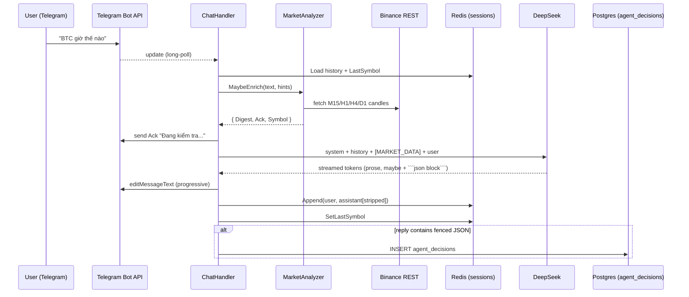

# Advisor Module — Engineering Context

> Drop this file into any prompt to give the agent full context on the
> advisor module. Keep it short, concrete, and up to date.

## 1. Purpose (one paragraph)

`j_ai_trade` is now a single-purpose Telegram trading advisor. A user
chats the bot, the backend fetches multi-TF candles from Binance, cooks
them into a compact `[MARKET_DATA]` digest (indicators per TF plus 20
raw OHLCV rows on the entry TF), and sends everything to **DeepSeek**.
**DeepSeek is the trader** — it decides buy/sell/wait and, when it
decides to trade, emits a fenced JSON block that the backend parses and
persists into `agent_decisions` (Postgres). Explanations-only replies
are not persisted.

There is **no HTTP server, no cron, no user/auth layer, no rule-engine
ensemble**. The whole program is a single long-running process that
long-polls Telegram, pipes each message through the advisor module, and
writes trade rows into Postgres.

## 2. Who orchestrates what

- **Backend = hands clean data to the LLM and stores the LLM's decision.**
  Owns the Telegram bot token, the DeepSeek API key, the Binance REST
  client, Redis session store, Postgres decision log.
- **DeepSeek = the trader.** Decides to open a trade or to wait.
  Streaming SSE; no callbacks into us.
- **Telegram Bot API = transport only.** Long-polling `getUpdates` for
  ingress; `sendMessage` / `editMessageText` / `sendChatAction` for
  egress.

## 3. High-level dataflow



## 4. Repo layout

```
main.go                           # Telegram-only entrypoint (no Gin)
config/
  postgres/postgres.go            # conn + AutoMigrate(agent_decisions)
  redis/redis.go                  # conn
brokers/binance/                  # REST client (no API key required)
common/                           # BaseModel, BaseCandle, app_error
logger/
telegram/                         # bot bindings (advisor_bot, listener, stream_editor, typing)
trading/
  indicators/                     # EMA, RSI, ATR, ADX, BB, Donchian, Swing
  marketdata/                     # shared CandleFetcher interface + Binance impl
  models/                         # Timeframe, MarketData (DTO)
modules/
  advisor/
    advisor_init.go               # hexagonal wiring (Transport+LLM+Session+Market+Decision)
    biz/
      chat_handler.go             # core dispatcher
      prompt_builder.go           # SystemPrompt + message assembly
      decision_parser.go          # extract/validate/strip fenced JSON
      session_store.go            # SessionStore interface (incl. LastSymbol)
      market_analyzer.go          # MarketAnalyzer interface + EnrichmentHints/Result
      llm_provider.go             # LLMProvider streaming interface
      chat_transport.go           # ChatTransport interface (send/edit/typing/updates)
      user_filter.go              # allowed-users guard
      market/                     # analyzer impl: intent, symbol resolver, digest, clock
    provider/deepseek/            # SSE adapter implementing LLMProvider
    storage/redis/                # SessionStore impl (sessions + LastSymbol + greeted flag)
    transport/telegram/           # ChatTransport impl (bubbles, typing)
    model/                        # session turn model
  agent_decision/
    model/agent_decision.go       # GORM model + Migrate
    biz/store.go                  # Store interface (Save)
    storage/postgres/store.go     # GORM adapter
```

## 5. Interfaces pinned by biz/ (never rename without migration note)

- `ChatTransport` — `Updates()`, `SendMessage`, `NewBubble`, `KeepTyping`, `Name`.
- `LLMProvider` — `Stream(ctx, []Turn) (<-chan string, <-chan error)`, `Name`.
- `SessionStore` — `Load`, `Append`, `Clear`, `TryGreet`, `MarkGreeted`, `GetLastSymbol`, `SetLastSymbol`.
- `MarketAnalyzer` — `MaybeEnrich(ctx, text, EnrichmentHints) (EnrichmentResult, error)` where
  - `EnrichmentHints{ LastSymbol string }`
  - `EnrichmentResult{ Digest, Ack, Symbol string }`
- `DecisionStore` (local to advisor/biz) — `Save(ctx, *adModel.AgentDecision) error`.

## 6. Market digest contract (what the LLM sees)

Wrapped in `[MARKET_DATA] ... [/MARKET_DATA]`:

1. Header: `<symbol> · generated <UTC> · entry_tf=<TF>`
2. `Current price (live, <TF>): <number>`  ← live last-trade, NOT closed-bar close
3. Next-close clocks per fetched TF
4. Per-TF prose blocks (ordered entry TF first): regime tag
   (`RANGE|CHOPPY|TREND_UP|TREND_DOWN`), ADX, LastClose, EMA20/50/200,
   RSI14, ATR (absolute + %), BB, swings, Donchian.
5. `Recent <entry_tf> candles` — tabular last 20 OHLCV rows (closed
   only) so the LLM can spot pin-bar / engulfing / doji / long wick.
6. JSON footer with `symbol, entry_tf, price, regimes{tf->tag}`.

Fetch budget per request: M15/H1/H4/D1 × 200 bars (warm-up for EMA200).

## 7. Prompt contract (SystemPrompt → DeepSeek)

- LLM is the trader, backend only hands it data.
- Language auto-mirrors the user (VI/EN). Tone: friendly buddy, 3–8
  sentences, minimal emoji, no heavy markdown.
- Numbers come EXCLUSIVELY from the `[MARKET_DATA]` block. Never
  recycle prices from prior replies; if no `[MARKET_DATA]` exists in
  this turn, admit "no fresh data" instead of guessing.
- If choosing to open a trade: append ONE fenced JSON block:
  ```json
  {
    "action": "BUY",
    "symbol": "BTCUSDT",
    "entry": 75820.5,
    "stop_loss": 75400.0,
    "take_profit": 76800.0
  }
  ```
  Nothing after the closing fence. Numeric values only. `symbol` matches
  the `[MARKET_DATA]` symbol exactly.
- If NOT trading (wait / unclear setup / choppy): free-form prose
  only, NO JSON block.

## 8. Decision persistence pipeline

1. After streaming completes, `ExtractDecision(reply)` runs the regex
   `(?s)```json\s*(\{.*?\})\s*```` and JSON-unmarshals into a
   `DecisionPayload`.
2. `DecisionPayload.valid()` enforces non-empty symbol, `BUY|SELL`
   action, and positive entry/SL/TP (no ordering check — malformed
   rows are still useful debug evidence).
3. Valid payloads are written via `DecisionStore.Save` (Postgres
   `agent_decisions`). Failures log but don't break the reply.
4. `StripDecisionFence(reply)` removes the JSON block before the turn
   is appended to Redis session history — keeps the bubble clean on
   follow-ups AND stops the LLM from thinking "I already traded this"
   on the next turn.

## 9. Session keys (Redis)

- `advisor:session:<chat_id>` — rolling turn history (TTL 1h).
- `advisor:greeted:<chat_id>` — greet-once flag.
- `advisor:lastsym:<chat_id>` — pinned symbol so "bây giờ bao nhiêu"
  follow-ups can re-trigger a fresh live fetch (TTL = session TTL).

## 10. Postgres schema (authoritative)

```sql
CREATE TABLE agent_decisions (
  id           UUID PRIMARY KEY DEFAULT gen_random_uuid(),
  symbol       TEXT        NOT NULL,
  action       TEXT        NOT NULL,              -- BUY | SELL
  entry        NUMERIC     NOT NULL,
  stop_loss    NUMERIC     NOT NULL,
  take_profit  NUMERIC     NOT NULL,
  created_at   TIMESTAMPTZ NOT NULL DEFAULT now(),
  updated_at   TIMESTAMPTZ NOT NULL DEFAULT now(),
  deleted_at   TIMESTAMPTZ                        -- GORM soft-delete
);
CREATE INDEX idx_agent_decisions_symbol ON agent_decisions(symbol);
```

Managed by GORM AutoMigrate in `config/postgres.AutoMigrate`. Additive
column changes land automatically on deploy.

## 11. Non-fatal failure matrix

| Failure                   | Behaviour                                                         |
| ------------------------- | ----------------------------------------------------------------- |
| Redis down                | `main.go` FATALs — session store is mandatory.                    |
| Postgres down             | Bot still runs; decisions parsed + logged but not persisted.      |
| Binance REST down         | Market enrichment disabled; user gets a polite "no data" reply.   |
| DeepSeek stream error     | Bubble replaced with a friendly error; session not polluted.      |
| Invalid / missing JSON    | Nothing saved; the prose reply reaches the user as normal.        |
| Schema drift in JSON      | `DecisionPayload.valid()` rejects; logged + skipped, no crash.    |

## 12. What was explicitly REMOVED (don't add back without discussion)

- `trading/strategies`, `trading/engine`, `trading/ensembles` — the
  4-strategy rule engine and ensemble aggregator. The LLM is the
  decision maker now; no rule votes, no regime detector (replaced by
  an inlined ADX+EMA tag), no veto pipeline.
- `cron_jobs/`, `notifier/` — the automated signal broadcaster.
- `modules/user`, `modules/auth`, `modules/otp`, `modules/order`,
  `modules/strategy_version` — all user/auth/order scaffolding.
- Gin HTTP server, routes, middlewares, Swagger, CORS.
- `appi18n/`, `helpers/`, `utils/`, `components/app_context/`,
  `config/pubsub/`, `config/app/`, `telegram/transport/gin/`,
  `telegram/telegram_service.go`.
- Candle models: `trading/models/strategy_vote.go`,
  `trading/models/regime.go`, `trading/models/fundamental.go`.

## 13. Config env vars (authoritative)

| Key                   | Purpose                                     |
| --------------------- | ------------------------------------------- |
| `TELEGRAM_BOT_TOKEN`  | Advisor bot long-poll + send/edit.          |
| `TELEGRAM_ALLOWED_IDS`| CSV of allow-listed chat IDs (optional).    |
| `DEEPSEEK_API_KEY`    | LLM auth.                                   |
| `DEEPSEEK_MODEL`      | e.g. `deepseek-chat` (optional default).    |
| `DB_HOST/PORT/USER/PASSWORD/NAME/SSLMODE` | Postgres.        |
| `REDIS_HOST/PORT`     | Redis.                                      |
| `ENV`                 | `PROD` skips `.env` load.                   |
