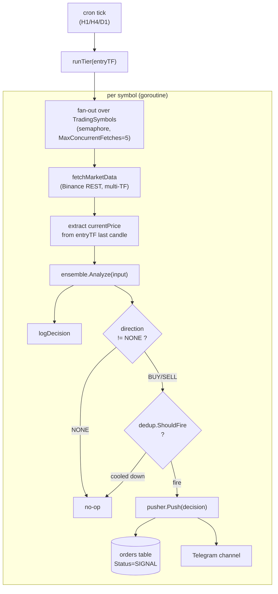
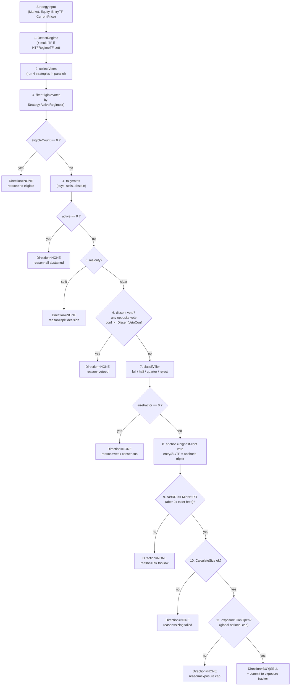

# Cron Signal Module — Engineering Context

> Drop this file into any prompt to give the agent full context on the
> existing cron-based signal broadcaster. This module is **independent of
> the advisor module** (see `.agent/advisor-module.md`) — they share
> `trading/engine` and `brokers/binance` but have separate lifecycles.

## 1. Purpose (one paragraph)

The **cron signal module** periodically scans a fixed universe of symbols
across three timeframes (H1 / H4 / D1), runs a 4-strategy ensemble, applies
risk + portfolio gates, and — when a setup passes all gates — pushes a
single decision through a pluggable `SignalPusher` chain (DB persistence +
Telegram broadcast). It does NOT talk to users; it only fires "here is a
setup" alerts into a Telegram channel and stores each fired signal as an
`orders` row tagged with a versioned `StrategyVersion`.

## 2. Entrypoint & wiring

Everything starts from [main.go](main.go):

```go
cronjobsManager.InitCronJobs(db) // main.go:82
```

`InitCronJobs` (in [cron_jobs/cron_job_manager.go](cron_jobs/cron_job_manager.go))
builds the production pusher stack and delegates to `InitCronJobsWithPusher`:

1. `registerStrategyVersion(db)` — snapshot current runtime config, hash it
   (sha256 over canonical JSON), and upsert a `StrategyVersion` row. Returns
   `uuid.Nil` on DB failure; signals still fire, just without persistence.
2. Build `MultiPusher`:
   - `NewDBSignalPusher(db, strategyVersionID)` — persists to `orders` table.
   - `NewTelegramPusher(telegram.NewTelegramService())` — sends formatted
     message to the Telegram channel specified by env.
3. Hand the pusher to `InitCronJobsWithPusher`, which builds per-tier
   ensembles, dedup caches, starts `cron.New()`.

Tests or alt deployments can skip `InitCronJobs` entirely and call
`InitCronJobsWithPusher(nil, notifier.NoopPusher{})` with their own pusher.

## 3. Schedule (UTC)

| Tier | Cron expression | Cooldown | Purpose                        |
| ---- | --------------- | -------- | ------------------------------ |
| H1   | `1 * * * *`     | 2h       | Intraday / short-term setups.  |
| H4   | `2 */4 * * *`   | 6h       | Swing setups.                  |
| D1   | `5 0 * * *`     | 20h      | Position / higher-conviction.  |

Each tier runs independently with its own `Ensemble`, `SignalDedup`, and
`TierTimeout` (90s per `runTier` invocation) but shares one
`ExposureTracker` across tiers so total portfolio notional is global.

## 4. End-to-end flow per tier



Key invariants per tier:

- Fan-out concurrency = 5 (Binance weight budget is generous but we're polite).
- Each symbol has its own 20s fetch timeout.
- `ctx.Done()` from `TierTimeout` cancels all pending symbols.
- Fired decisions go to `MultiPusher`; DB failure does NOT block Telegram and vice versa.

## 5. Tier → TF wiring

Each tier configures the ensemble with specific timeframes (see
`buildEnsemble` in `cron_job_manager.go`):

| Tier (EntryTF) | TrendTF | StructureTF | HTFRegime (multi-TF confirm) | ExposureTTL |
| -------------- | ------- | ----------- | ---------------------------- | ----------- |
| H1             | H4      | D1          | H4                           | 2h          |
| H4             | D1      | D1          | D1                           | 6h          |
| D1             | D1      | D1          | (none)                       | 20h         |

- **EntryTF** — where entry/SL/TP are computed.
- **TrendTF** — used by `TrendFollow` for higher-TF trend filter.
- **StructureTF** — used by `Structure` for swing highs/lows.
- **HTFRegime** — optional; when set, `DetectRegimeMulti` downgrades entry-TF
  regime to CHOPPY if HTF strongly contradicts, preventing trend-against-tide
  setups.

## 6. Universe of symbols

Defined at the top of [cron_jobs/cron_job_manager.go](cron_jobs/cron_job_manager.go):

```
BTCUSDT ETHUSDT BNBUSDT SOLUSDT
XRPUSDT ADAUSDT AVAXUSDT LINKUSDT
DOTUSDT ATOMUSDT NEARUSDT SUIUSDT
DOGEUSDT TRXUSDT BCHUSDT LTCUSDT
XAUUSDT
```

All symbols are Binance futures-style tickers. `XAUUSDT` is the tokenized
gold pair on Binance — not real forex XAU/USD. Flag for review when
integrating real forex feeds.

To add a symbol: append to `TradingSymbols`, restart. The strategy version
fingerprint will change (pairs are part of `ConfigSnapshot`), so a new
`strategy_versions` row is inserted automatically.

## 7. Ensemble decision pipeline

`Ensemble.Analyze` (in [trading/engine/ensemble.go](trading/engine/ensemble.go))
runs 11 numbered steps per (symbol, timeframe). A decision only fires when
ALL gates pass:



Default thresholds (from `DefaultEnsembleConfig`):

- `FullAgreement=3, FullRatio=0.75, FullAvgConf=70` → tier=full (100% size)
- `HalfAgreement=2, HalfRatio=0.60, HalfAvgConf=75` → tier=half (50% size)
- `QuarterMinConf=85` → tier=quarter (25% size, solo strong voice)
- `DissentVetoConf=85` → any opposite vote at ≥85% kills the trade
- `MinNetRR=1.3` → min reward:risk AFTER round-trip taker fees

Ratio-based agreement (not absolute) is deliberate: some strategies are
mutually exclusive by regime, so 4/4 would be unreachable by design.

## 8. Strategies (4 orthogonal)

Each strategy declares its `ActiveRegimes()` and is only counted when the
detected regime matches. See `trading/strategies/`.

| Strategy        | Hypothesis                                              | Active regimes                      | Key params                      |
| --------------- | ------------------------------------------------------- | ----------------------------------- | ------------------------------- |
| `trend_follow`  | HTF trend persists; buy pullbacks to EMA20.             | trend_up, trend_down                | EMA 20/50/200, ATR 1.5x SL/3x TP|
| `mean_reversion`| Price reverts to BB midline when RSI extreme & ADX low. | range, choppy (adx<25)              | BB 20±2σ, RSI 14 (30/70)        |
| `breakout`      | Donchian(20) break + ATR confirm → momentum continues.  | any                                 | Donchian 20, ATR 1.5x SL/3x TP  |
| `structure`     | Swing-high/low BOS (break-of-structure) on StructureTF. | any                                 | swing lookback=3, ATR 1.5x/3x   |

Magic numbers are mirrored in `engine.defaultStrategyParams()` (see
[trading/engine/versioning.go](trading/engine/versioning.go)) — whenever you
tune a strategy, update this mirror too so the fingerprint flips.

Adding a new strategy:

1. Create `trading/strategies/<name>.go` implementing `engine.Strategy`.
2. Register in `buildEnsemble`.
3. Add an entry to `defaultStrategyParams()` with its magic numbers.
4. (optional) Add an entry to `EnsembleConfig.FullAgreement` threshold
   tuning — adding a 5th strategy may warrant raising `FullAgreement` to 4.

## 9. Risk manager (position sizing)

[trading/engine/risk_manager.go](trading/engine/risk_manager.go) — rules:

- Fixed-fractional: risk `RiskPerTradePct=1%` of equity per trade.
- Notional = `intendedRisk / SL%` → same $ risk across pairs.
- Leverage = `notional / (equity * MarginRatio=0.10)` → capped per pair by
  `PairConfig.MaxLeverage` and `PairConfig.MaxNotionalUSD`.
- Volatility brake: if `ATR% > 5%`, extra 0.7x reduction.
- Min SL distance = `max(6*taker_fee, 0.3%)` so fees don't dominate.
- If any cap shrinks actual risk below `MinActualRiskRatio=0.5` of intended
  → refuse the trade (`CappedBy` explains which cap).

`PaperEquity=1000.0` in cron — virtual equity only; sizing math is real but
nothing is actually executed.

## 10. Dedup — `SignalDedup`

[trading/engine/dedup.go](trading/engine/dedup.go) prevents the same setup
from re-alerting every cron tick. Key = `symbol|timeframe|direction|priceBucket`
where `priceBucket` rounds price to ~0.1% (3 significant digits), so BTC
drifting 60123 → 60180 is the same bucket, but 60800 is a new one.

Cooldowns match the tier TTLs (H1=2h, H4=6h, D1=20h). A materially
different price breaks cooldown even inside the window.

## 11. Exposure tracker

[trading/engine/exposure.go](trading/engine/exposure.go) is an in-memory
accounting of committed notional per symbol, shared across all 3 tier
ensembles via `exposure := engine.NewExposureTracker()` in
`InitCronJobsWithPusher`. Enforces `RiskManager.MaxTotalNotional=3.0x
equity`.

Each entry carries a TTL equal to `ExposureTTL` (= tier cooldown). This is
important for signal-only mode where nothing "closes" the position — without
TTL an entry would stay forever. When live exec is wired in, call
`Release()` on SL/TP fills and treat the TTL as a safety net.

A second signal for the same symbol REPLACES (doesn't stack) the notional
entry, so re-alerts in adjacent tiers don't double-count.

## 12. Notifier chain

```
notifier/
  pusher.go             SignalPusher interface + NoopPusher + MultiPusher
  telegram_pusher.go    formats TradeDecision → Telegram message
  db_pusher.go          writes TradeDecision → orders table (Status=SIGNAL)
```

`MultiPusher` fans out to every pusher; the first error is returned but all
later pushers still execute — so a DB outage doesn't suppress Telegram.

Telegram message format (see `formatDecision` in `telegram_pusher.go`):

```
BTCUSDT BUY [H1 / trend_up]
Tier: half (50% size) | Conf: 74.2 | NetRR: 1.81
Agreement: 3/4 eligible (ratio 0.75)
Entry: 60123.4500 | SL: 59500.0000 | TP: 61800.0000
Lev 3x | Notional $300.00 | Risk $10.00 [capped-by leverage]
Why: BUY in regime=trend_up: 3/4 eligible agree, ratio=0.75, avgConf=74.2, tier=half, anchor=trend_follow
```

## 13. Persistence — `orders` + `strategy_versions`

### `orders` table ([modules/order/model/order.go](modules/order/model/order.go))

Every fired signal inserts a row with `Status=SIGNAL` and every field of
`TradeDecision` mirrored (entry/sl/tp/conf/tier/size/notional/leverage/
risk/netRR/agreement/eligible/regime/timeframe/reason/votes JSONB/capped_by).
Linked to `strategy_version_id` for backtest reproducibility. Columns
`OpenedAt/ClosedAt/Close/ProfitNLoss` remain for future live-exec use.

### `strategy_versions` table

[modules/strategy_version/biz/registry.go](modules/strategy_version/biz/registry.go):

- `ActivateOrCreate(ctx, snapshot)` called once at boot.
- Builds `ConfigSnapshot` (ensemble thresholds + risk params + pair configs +
  sorted pair list + strategy magic numbers + per-tier TF wiring) → canonical
  JSON → sha256 = `Fingerprint`.
- Three outcomes:
  - **Same fingerprint as active row** → no-op.
  - **Fingerprint matches an inactive row** → reactivate (clear `EndedAt`).
  - **New fingerprint** → close active row (`EndedAt=now`), insert new row
    with auto-generated version label + `DiffSnapshots` notes.
- Guarantees: at most one row has `EndedAt IS NULL`.

Result: every `orders` row is reproducible. Given the
`strategy_version_id`, you know the exact thresholds, pair configs, and
strategy params that produced it — essential for honest backtests.

## 14. Env vars

| Env var                    | Used by                               | Default / notes                       |
| -------------------------- | ------------------------------------- | ------------------------------------- |
| `J_AI_TRADE_BOT_V1`        | `telegram/telegram_service.go`        | Bot token (required for TG pusher).   |
| `J_AI_TRADE_BOT_V1_CHAN`   | `telegram/telegram_service.go`        | Channel/chat ID for broadcasts.       |
| `ENV`                      | `main.go`                             | Set to `PROD` to skip `.env` loading. |
| (Postgres envs)            | `config/postgres`                     | DB connection; DB-optional — cron still runs with `NoopPusher` equivalent. |

Binance REST is public — no API key required for klines.

## 15. Failure modes

| Failure                              | Behavior                                                              |
| ------------------------------------ | --------------------------------------------------------------------- |
| Binance timeout on one symbol        | That symbol logs warn, skipped; other symbols unaffected.             |
| Tier exceeds `TierTimeout=90s`       | Context cancels; pending symbols abort. Next tier tick unaffected.    |
| DB down at boot                      | `registerStrategyVersion` returns `uuid.Nil`; signals fire without persistence. |
| DB pusher error                      | Telegram still sends; error logged.                                   |
| Telegram 4xx/5xx                     | DB still writes; error logged.                                        |
| Strategy panic                       | Per-strategy goroutine captures error, returns `NONE` vote.           |
| Regime detection with <220 candles   | Returns `RegimeChoppy` (safe fallback).                               |

## 16. Testing

- `trading/engine/*_test.go` — unit tests for ensemble, dedup, exposure,
  regime, risk. Includes a shared `testhelpers_test.go`.
- `trading/strategies/strategies_test.go` — per-strategy votes on fixtures.
- `trading/indicators/indicators_test.go` — numeric correctness of
  EMA/RSI/ATR/ADX/Donchian/BB.

No cron-level integration test currently — `runTier` is manually verified
by watching logs on local runs. Good candidate for a future test using
`NoopPusher` + fake `MarketDataFetcher`.

## 17. Relationship to the advisor module

- **Shared**: `trading/engine` (Ensemble / RiskManager / ExposureTracker /
  Regime / versioning), `trading/strategies`, `trading/indicators`,
  `brokers/binance`, `common`.
- **Not shared**: the advisor has its own request-scoped ensemble without
  dedup and without committing to the shared `ExposureTracker` (advisor is
  read-only advice, cron is the "position taker" in paper mode).
- **Planned refactor**: extract `buildEnsemble` from
  `cron_job_manager.go` into `engine.DefaultEnsembleFor(tf)` so both modules
  share a single strategy-set definition. Cron keeps its exposure/dedup;
  advisor instantiates with `nil` tracker.

## 18. How to make common changes

- **Add a symbol** → edit `TradingSymbols` slice, restart. A new
  `strategy_versions` row will be inserted automatically.
- **Tune a threshold** (e.g. `FullAvgConf` 70 → 72) → change
  `DefaultEnsembleConfig`, restart. Fingerprint changes, new version row,
  notes auto-diffed.
- **Change a strategy's magic number** → update the strategy file AND mirror
  it in `engine.defaultStrategyParams()`. Without the mirror, fingerprint
  stays the same and backtests become unreproducible.
- **Add a pusher** (e.g. Discord) → implement `notifier.SignalPusher`,
  prepend/append to `MultiPusher` in `InitCronJobs`.
- **Change cron schedule** → edit the three `c.AddFunc` lines; remember to
  update `tierCooldown` accordingly.
- **Pause a tier temporarily** → comment its `c.AddFunc`, no other changes.

## 19. Non-goals (current state)

- Real trade execution (paper/signal-only mode).
- Backtesting runner (infra exists via `strategy_version_id` but no runner yet).
- Per-user signal routing (single global Telegram channel).
- Dynamic universe (hard-coded slice).
- Machine-learning strategies (all four are rule-based).
